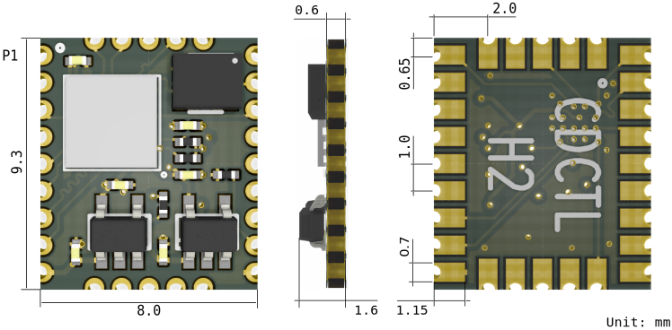
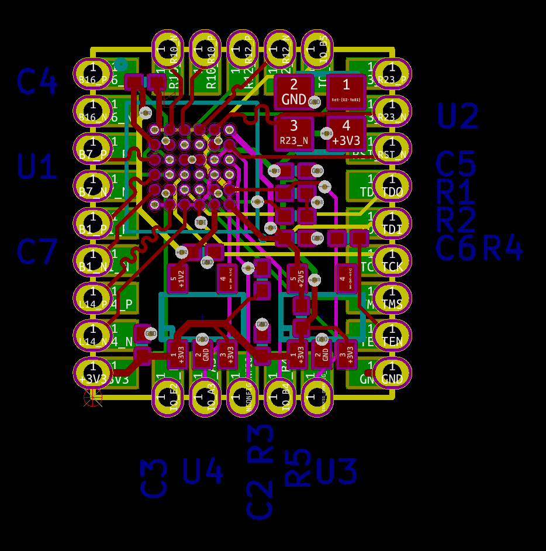
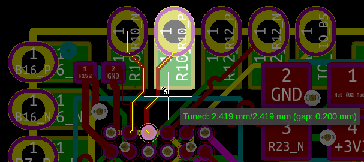

Altera MAX10 FPGA 10M02DCV36 Tiny Core Board
=======================================

### Dimensions

### Schematic

 - [cdctl_h2_schematic.pdf](files/cdctl_h2_schematic.pdf)

### Components

### Differential Pairs Length

 - B16: 3.218 mm
 - B7: 2.174 mm
 - B1: 2.642 mm
 - L14: 4.573 mm
 - R23: 5.937 mm
 - R12: 3.192 mm
 - R10: 2.419 mm

