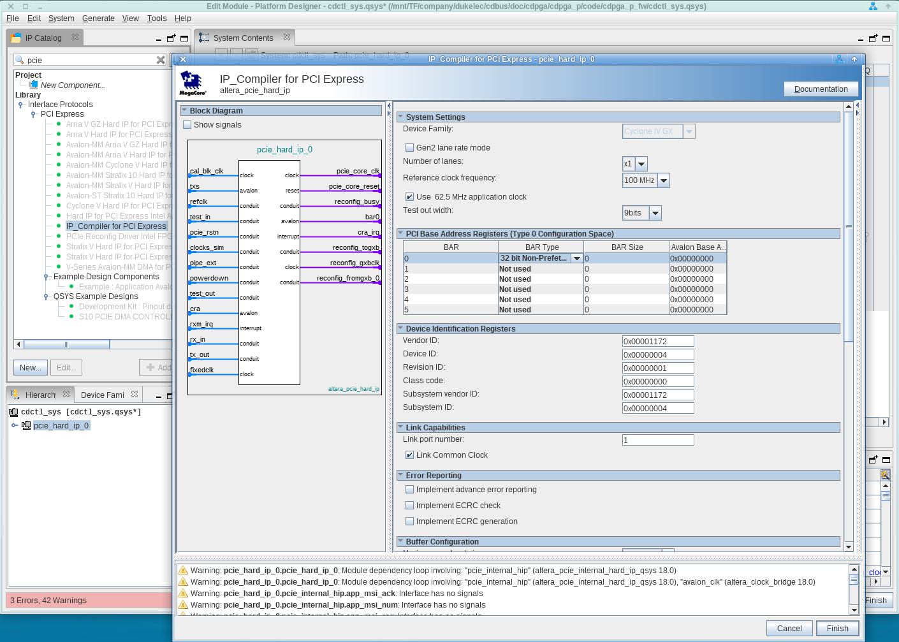
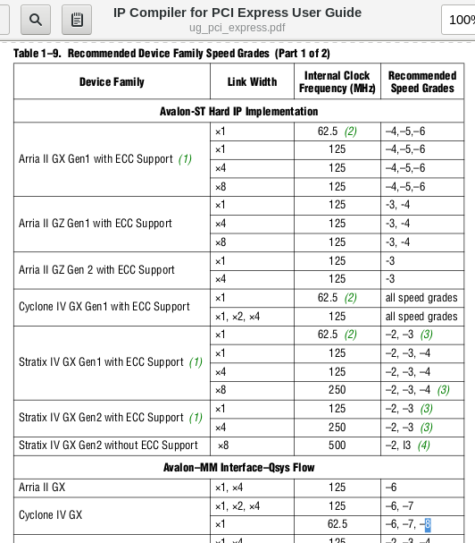
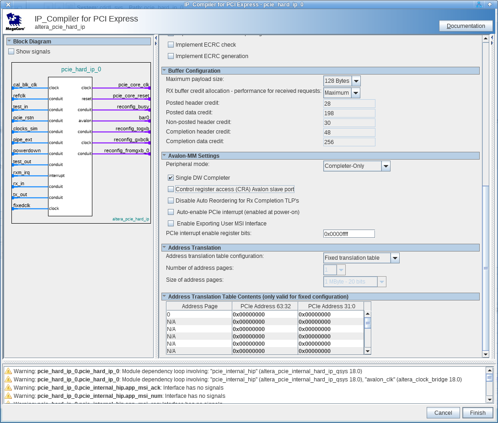
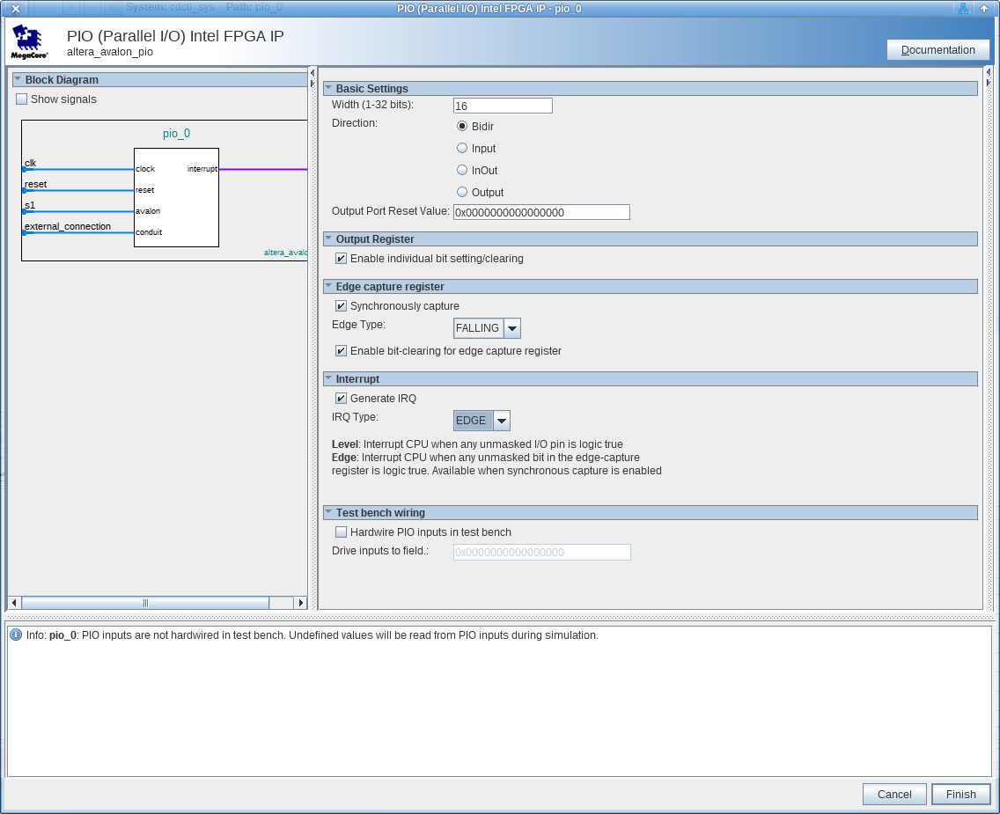
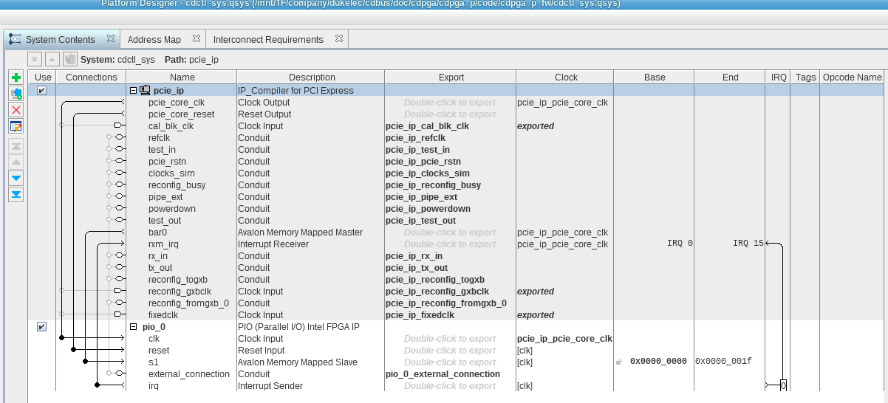
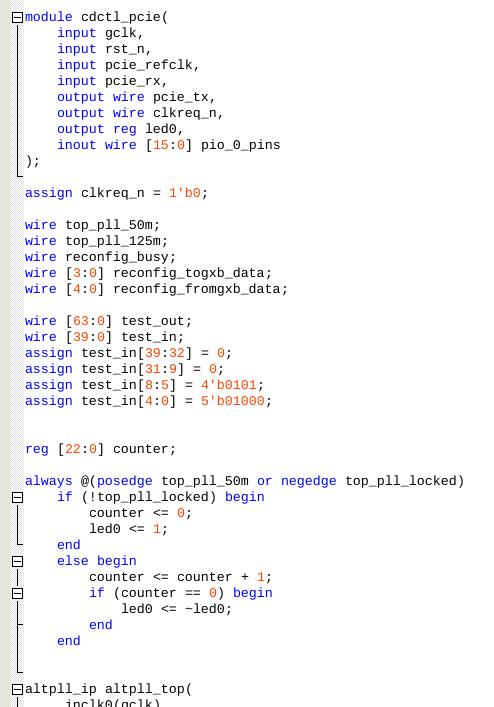
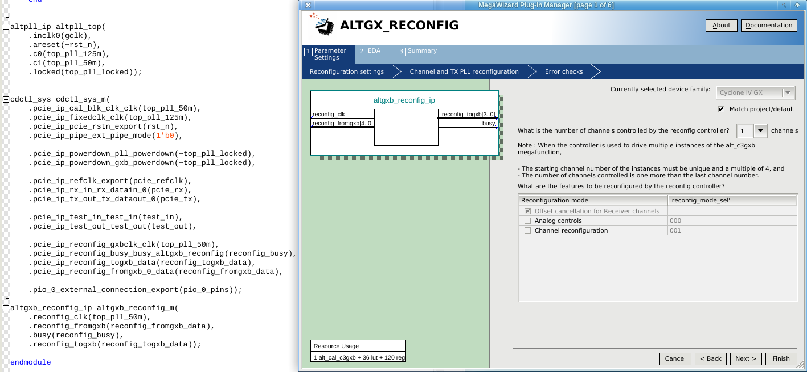
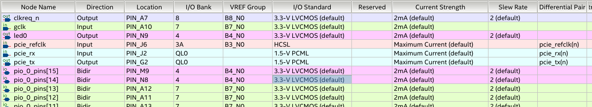
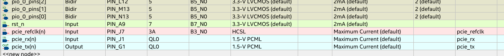

## How to create a new project

### Create QSYS project

Open `Platform Designer` after create an empty Quartus project.

#### Add PCIe IP

First add one `altera_pcie_hard_ip` by `IP_Compiler for PCI Express`:

 - Change `Number of lanes` to `x1`;
 - Select `62.5 MHz application clock` for low speed grade device: 
 - Change BAR0 Type to `32 bit Non-Prefetchable`.

 - Change `Peripheral mode` to `Completer-Only`;
 - Select `Single DW Completer`;
 - Deselect `Control register access (CRA) Avalon slave port`.

#### Add PIO IP

#### Connect and export

Finished:

### Setup top level

The transceivers configuration moudle is created and connected externally:

Pin Planner:

