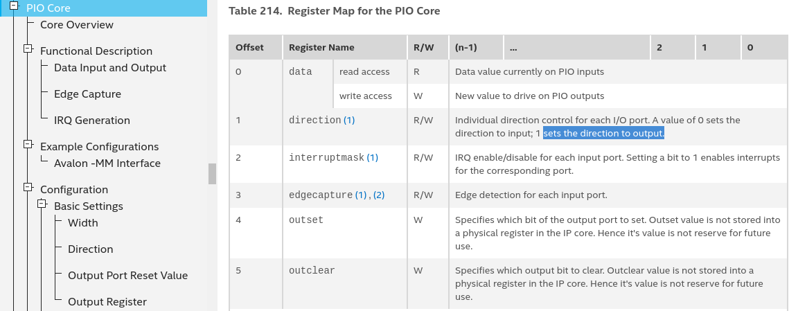
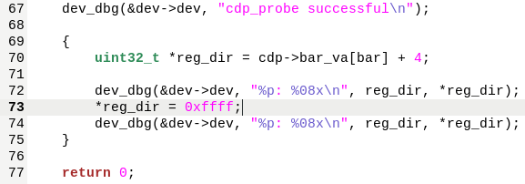

## How to test

After power up, the green led start blink.

The `pio_0_pins` is 16 bit width, the highest two bits connect to the red and blue led.

All of `pio_0_pins` is configured as input by default, when we insmod our driver, at the end of probe function,
we change the value of `direction` register to `0xffff`, then `pio_0_pins` outputs the default value `0x0000`, we can see the red and blue led lights up.

## Firmware overview and creation
[create_new_project.md](create_new_project.md)

