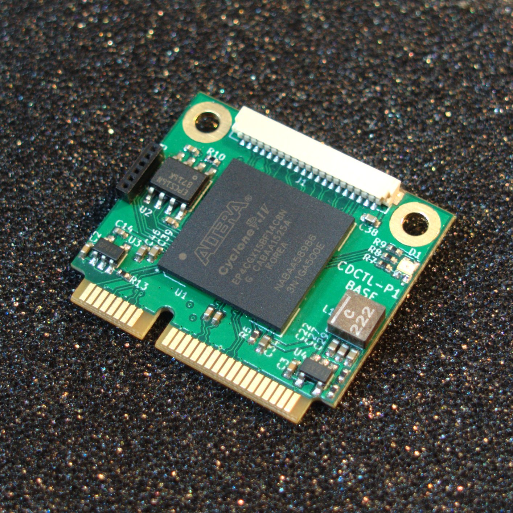
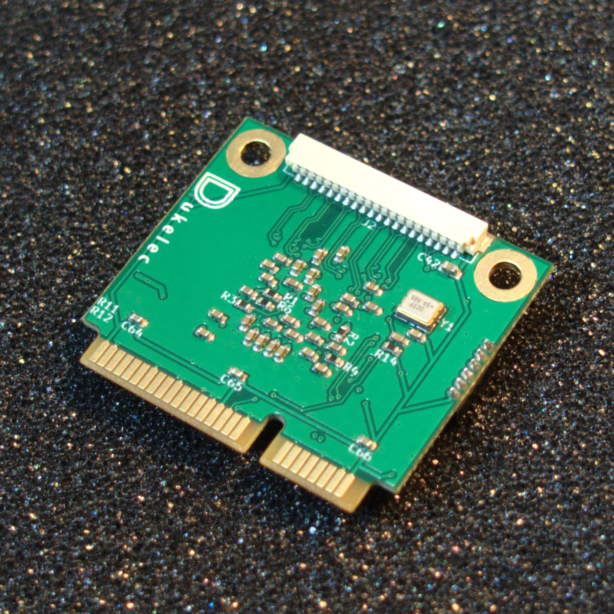

Altera Cyclone IV GX FPGA Mini PCI-E Board
=======================================
***-- CDPGA-P1***

Support devices: EP4CGX15BF14/EP4CGX30BF14 (default: EP4CGX15BF14C8N)

Connector model: SM20B-SURS-TF (x2 pcs)

 

### Schematic and PCB

 - [cdctl_p1_sch.pdf](files/cdctl_p1_sch.pdf)
 - [cdctl_p1_pcb.pdf](files/cdctl_p1_pcb.pdf)

### Software

Minimal example project: [code/](./code/)
